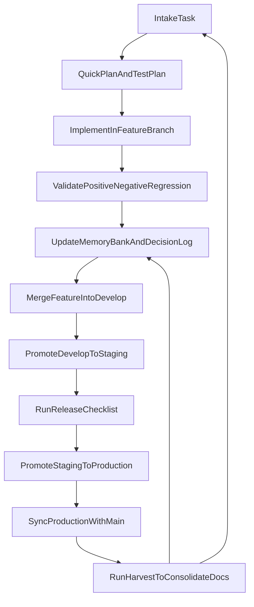

# SPINE

SPINE is the backbone framework on top of which agents operate.

It is a reusable instruction and workflow repository for local projects, designed for solo development with predictable execution, low coupling, and pragmatic quality controls. It started as a personal operating system and is now shared with the community.

## Why SPINE Exists

This repository centralizes:
- delivery workflow (adapted GitFlow for solo development);
- skill governance (minimal allowlist and controlled trials);
- quality guardrails (test-first validation discipline);
- memory-bank structure for context, decisions, and continuous learning.

The goal is to avoid rebuilding process from scratch on every new repository.

## Core Principles

- Simplicity first: no overengineering.
- Minimal rules, but non-optional.
- Opt-in per project: Spine rules are only loaded when a project explicitly opts in.
- Every delivery leaves quality evidence (test + memory + decision).
- Lessons learned become operational standards.

## Repository Layout

```text
spine/
├── templates/
│   └── docs/
│       ├── memory/ (empty templates for bootstrap)
│       ├── governance/
│       ├── quality/
│       └── workflow/
├── docs/ (internal Spine use - not versioned)
├── commands/
│   ... (execution command templates)
├── agents/
│   ... (OpenCode agent definitions, e.g. ask.md)
├── skills/
│   ... (curated skill repository)
├── rules/
│   ... (source-of-truth rules in .md)
├── scripts/
│   ... (spine.py, spine_validate.py)
└── tests/
```

## Setup

Spine installs **per project only**. On Linux and macOS, `install` links `.spine` to a local Spine clone and wires rules, commands, and skills with symlinks. On Windows, the same `install` command copies those trees as real files (vendor mode).

### 1. Clone Spine (machine-local)

Clone the Spine repository once on your machine (outside consumer project trees):

```bash
git clone https://github.com/fjuste/spine.git ~/Workspace/ide/spine
```

### 2. Install Spine (Python)

From the consumer project root. Python 3.9+ is required (`python3` on Linux/macOS; `py -3` or `python` on Windows).

```bash
cd /path/to/my-project
python3 ~/Workspace/ide/spine/scripts/spine.py install
python3 ~/Workspace/ide/spine/scripts/spine.py install --core
python3 ~/Workspace/ide/spine/scripts/spine.py install --copy
python3 ~/Workspace/ide/spine/scripts/spine.py install --copy --update
python3 ~/Workspace/ide/spine/scripts/spine.py install --no-graphify-prompt
```

On Linux and macOS, `install` creates `.spine` (symlink to the clone) when it is missing, then wires IDE trees, seeds `docs/`, and merges `opencode.json`. Use `--spine-dir=PATH` if the clone is not the repo that contains `spine.py`, `--force` to replace a mismatched symlink, or `--dry-run` to preview. `--copy` writes physical IDE files and keeps `.spine` as a symlink. `--rsync` populates `.spine` as a real directory and still wires IDEs with relative symlinks.

On Windows, `install` uses vendor mode: `.spine` is a real directory, IDE trees are real files, and `.spine-vendor` is written. `--copy` and `--rsync` are refused there. See **Windows** below.

> **Important:** Slash commands (`/spine-bootstrap`, `/spine-plan`, etc.) are **not** available until this step completes.

`spine.py install` is idempotent — existing `docs/` content is never overwritten. `install --update` reconciles wiring and does **not** `git pull`. Pulling is `spine.py update`.

**Default on Linux and macOS (symlink wiring)** creates:

```text
PROJECT_ROOT/
├── .spine              → Spine repository (gitignored symlink)
├── .agents/skills/     catalog symlinks plus /spine-* skill bundles (gitignored)
├── .agents/rules/      core rule symlinks (Antigravity)
├── .cursor/rules/      core rule symlinks (committable)
├── .cursor/commands/   command symlinks (committable)
├── .cursor/skills/     → .agents/skills/ (committable)
├── .opencode/commands/ command symlinks (committable)
├── .opencode/agents/   agent symlinks (committable)
├── .claude/skills/     → .agents/skills/ (committable)
├── opencode.json       created or merged (versioned)
└── docs/               memory bank templates (versioned)
```

Windows `install` produces the vendor layout in **Optional: Vendor install** (real files, committed, marked by `.spine-vendor`).

**Hybrid (`--copy`)**, Linux and macOS only, creates the same layout with **physical file copies** under `.agents/`, `.cursor/`, `.claude/`, and `.opencode/` (versionable). Only `.spine` remains a local symlink (gitignored). Teammates get applied trees via `git pull`; maintainers refresh with `python3 .spine/scripts/spine.py install --copy --update`.

#### Platform wiring matrix

| Artefato Spine | Cursor | OpenCode | Claude Code | Antigravity |
|---|---|---|---|---|
| `skills/` | `.cursor/skills` | (hub) | `.claude/skills` | `.agents/skills/` |
| `rules/` | `.cursor/rules` | URLs in `opencode.json` | (via skills/CLAUDE.md) | `.agents/rules/` |
| `commands/` (slash) | `.cursor/commands` | `.opencode/commands` | `.claude/skills/<name>/` via hub | `.agents/skills/<name>/` |

Claude Code and Antigravity invoke `/spine-*` as skills. The installer writes `.agents/skills/<name>/SKILL.md` for each file in `commands/`. Claude Code reads that bundle through `.claude/skills`, which points at the hub. Cursor and OpenCode keep the command files themselves.

### 3. Bootstrap (IDE, recommended)

Open (or reload) the project in your agent IDE, then run:

```
/spine-bootstrap
```

`/spine-bootstrap` performs a **deep assessment** of the codebase (and Graphify when present), then fills memory bank templates with **agent-optimized** detail: `global/*` (including project-specific alterations, known risks, and unplanned opportunities), and `progress.md` Current state. It does **not** fill `roadmap.md`, create active tasks, or produce delivery plans — use `/spine-plan` next.

Readiness check: `python3 .spine/scripts/spine_validate.py bootstrap`. Validators are cross-platform Python 3.9+; on Windows use `py -3` or `python` when `python3` is unavailable.

Requires install complete.

**Prerequisites for slash commands:** `python3 /path/to/spine/scripts/spine.py install` from the project root. If slash commands are missing in the IDE, run that command from the terminal, then reload the project.

#### Manual `opencode.json` (alternative)

Each Spine project opts in via `opencode.json` with `instructions` pointing to Spine rule URLs:

```json
{
  "$schema": "https://opencode.ai/config.json",
  "model": "opencode-go/deepseek-v4-pro",
  "small_model": "nvidia/deepseek-ai/deepseek-v4-pro",
  "default_agent": "ask",
  "instructions": [
    "https://raw.githubusercontent.com/fjuste/spine/refs/heads/master/rules/01-core-protocol.md",
    "https://raw.githubusercontent.com/fjuste/spine/refs/heads/master/rules/02-memory-bank.md",
    "https://raw.githubusercontent.com/fjuste/spine/refs/heads/master/rules/03-code-quality.md"
  ],
  "compaction": { "enabled": true, "strategy": "summarize", "threshold": 16000 },
  "agent": {
    "plan": { "mode": "primary", "model": "opencode-go/deepseek-v4-pro", "variant": "medium" },
    "build": { "mode": "primary", "model": "opencode-go/deepseek-v4-pro", "variant": "medium" },
    "ask": { "mode": "primary", "model": "opencode-go/deepseek-v4-pro", "prompt": "{file:.spine/agents/ask.md}" }
  }
}
```

Canonical full template: [`templates/opencode.json`](templates/opencode.json). Ask loads its prompt from `.spine/agents/ask.md` via `{file:...}` (`.spine` may be a symlink or a vendored directory). `python3 .spine/scripts/spine.py install` also places the file in `.opencode/agents/` for OpenCode-native discovery: a symlink on Linux and macOS, a real file in vendor mode.

> **Why URLs instead of local paths?**
> - **Portable:** works on any machine without a local Spine clone
> - **Auto-updating:** OpenCode fetches rules on each session; `git push` on Spine propagates changes
> - **Versionable:** pin to a tag (`refs/tags/v1.0.0`) for stability, or use `refs/heads/master` for latest
> - **Commitable:** `opencode.json` is plain JSON, safe to commit to the project repo

**Version pinning:** replace `refs/heads/master` with `refs/tags/v1.0.0` in each URL.

> **Important:** Never add Spine `instructions` to global `~/.config/opencode/opencode.json`. Rules and agents are opt-in per project only (`opencode.json` + `.opencode/agents/`).

### 4. Non-Spine projects

Projects that do not follow Spine simply omit Spine rule URLs from their `opencode.json`. They do not need `.spine` or `spine.py`.

### 5. Updating

Symlink and `--rsync` installs, from the consumer repository:

```bash
python3 .spine/scripts/spine.py update
```

This pulls the Spine clone (`git pull` through a symlink, or the canonical clone and then a sync for `--rsync`), reconciles wiring (`install --update --force`), syncs `opencode.json`, and preserves `docs/memory/`. It refuses a vendored tree (`.spine-vendor`).

Vendor installs, including every Windows `install`, refresh from the upstream clone:

```bash
python3 /path/to/spine/scripts/spine.py vendor --update --spine-dir=/path/to/spine --project-root=.
```

On Windows the same refresh is `py -3 C:\tools\spine\scripts\spine.py install --update --project-root=C:\dev\my-project`. Run it from the upstream clone, not from the project's vendored `.spine`.

- **Rules:** Projects using URL-based `instructions` receive updates when OpenCode fetches rules each session.
- **Skills and commands:** symlink and `--rsync` `update` reconciles links after the pull. Vendor update overwrites the copied trees from `--spine-dir`.

Optional update modes:

```bash
python3 .spine/scripts/spine.py update --dry-run
python3 .spine/scripts/spine.py update --replace-opencode
python3 .spine/scripts/spine.py update --with-graphify      # see "Optional: Graphify"
python3 .spine/scripts/spine.py update --graphify-init      # setup + first graph build
```

## Optional: Vendor install (commit Spine into the project)

On Linux and macOS, symlink mode remains the default (`spine.py install`). Use the `vendor` subcommand when the team needs Spine as **real files** in the consumer repo (share via `git clone` with no per-machine Spine clone for day-to-day use). On Windows, `install` already vendors; do not pass `vendor` for a normal install.

Vendor mode copies Spine into `.spine/` (no nested `.git`) and materializes `.agents/`, `.cursor/`, `.opencode/`, and `.claude/` as real files. Those trees are intended to be **committed**.

### Install (maintainer)

```bash
cd /path/to/consumer-project
python3 /path/to/spine/scripts/spine.py vendor --spine-dir=/path/to/spine
# minimal skills: add --core
```

On Windows, `install` already uses vendor mode. See **Windows** below.

If the project already has symlink-mode Spine, conversion is refused unless you opt in:

```bash
python3 /path/to/spine/scripts/spine.py vendor --force --spine-dir=/path/to/spine
```

Then commit:

```bash
git add .spine .agents .cursor .opencode .claude .spine-vendor docs opencode.json .gitignore
git commit -m "chore: vendor Spine into project"
```

Teammates only need `git pull` — no symlink privilege and no local Spine clone for IDE use.

### Update (maintainer)

Overwrite vendored trees from an upstream Spine clone (required `--spine-dir`; never use the project's own `.spine` as source):

```bash
python3 /path/to/spine/scripts/spine.py vendor --update --spine-dir=/path/to/spine --project-root=.
git add .spine .agents .cursor .opencode .claude .spine-vendor
git commit -m "chore: update vendored Spine"
git push
```

`docs/memory/` content is never overwritten; `opencode.json` is merged non-destructively.

### Notes

- Marker file: `.spine-vendor` (signals vendor mode).
- Do **not** ignore `.spine`, `.agents/`, `.cursor/`, `.claude/`, or `.opencode/` in vendor mode (the script strips those ignores when present).
- Graphify / MkDocs are not co-installed by `vendor` or by Windows `install`. The interactive prompt and `--with-graphify` / `--with-mkdocs` apply to symlink `install` on Linux and macOS.
- Uninstall vendor trees (leaves `docs/` and `opencode.json`): `python3 .spine/scripts/spine.py uninstall`

### Windows

The same Python CLI is the Windows installer. [Python 3.9+](https://www.python.org/downloads/windows/) is required (`winget install Python.Python.3.12`). Use `py -3` or `python` when `python3` is not on PATH. On Windows, `install` uses vendor mode automatically (real files, `.spine-vendor` marker). No extra flag.

```powershell
py -3 C:\tools\spine\scripts\spine.py install --project-root=C:\dev\my-project
py -3 C:\tools\spine\scripts\spine.py install --update --project-root=C:\dev\my-project
py -3 C:\dev\my-project\.spine\scripts\spine.py uninstall --project-root=C:\dev\my-project
```

Then commit the trees exactly as in **Install (maintainer)** above. Run `--update` from the upstream Spine clone, not from the project's vendored `.spine`.

Limitations:

- Graphify / MkDocs are not co-installed by Windows `install` (vendor mode).
- On Linux and macOS, `install` stays symlink mode. Vendor mode runs only when you pass the `vendor` subcommand.

## Optional: Graphify

Graphify is an optional **code-structure** layer for consumer projects. **Spine** owns conceptual/documentary context (`docs/memory/`); **Graphify** accelerates where to look in source via `GRAPH_REPORT.md` and `graphify query`. The memory bank remains the operational source of truth.

When active, agents follow the **Graphify Discovery Protocol** in `rules/02-memory-bank.md`: read `graphify-out/GRAPH_REPORT.md` → run `graphify query` → targeted file reads.

### Install CLI (once per machine)

```bash
uv tool install graphifyy    # recommended; minimum graphifyy 0.7.16 for tri-platform co-install
# alternatives: pipx install graphifyy | pip install graphifyy
```

### Enable Graphify (primary: interactive prompt)

During `python3 .spine/scripts/spine.py install` (or `python3 .spine/scripts/spine.py install --update`) in a terminal, answer **yes** at the Graphify prompt. No extra flags are required. The prompt runs on Linux and macOS symlink installs. Windows `install` uses vendor mode and does not ask or co-install Graphify.

This copies `.graphifyignore`, runs `graphify update .` (produces `graphify-out/graph.json` + `GRAPH_REPORT.md`), and co-installs Graphify for Cursor, OpenCode, and Claude Code (default `--targets=cursor,opencode,claude`).

**Non-interactive / CI only:**

```bash
python3 .spine/scripts/spine.py install --with-graphify          # same full co-install, no prompt
python3 .spine/scripts/spine.py install --no-graphify-prompt       # skip prompt (also skipped when not a TTY)
```

### Tri-platform co-install (what "yes" installs)

| IDE | Graphify artifact | Spine coexistence |
|-----|-------------------|-------------------|
| **Cursor** | `.cursor/rules/graphify.mdc` | Spine rule symlinks in same directory |
| **OpenCode** | `.opencode/plugins/graphify.js` + plugin in `opencode.json` | Spine 3 URL `instructions` preserved |
| **Claude Code** | `CLAUDE.md` section + PreToolUse hook | `.claude/skills/` Spine symlink preserved |

Optional git hooks: add `--graphify-hooks` to install (interactive yes does not enable hooks by default).

Remove platform artifacts only: `python3 .spine/scripts/spine.py install --graphify-uninstall`

### Existing project already using Spine

Re-run install and answer yes at the prompt (also offered on `--update` when integration is incomplete):

```bash
cd /path/to/existing-project
python3 .spine/scripts/spine.py install
# or: python3 .spine/scripts/spine.py install --update
```

**Non-interactive:** `python3 .spine/scripts/spine.py install --with-graphify` or `python3 .spine/scripts/spine.py update --graphify-init`

**Manual fallback** (if flags are unavailable on an old Spine clone):

```bash
python3 .spine/scripts/spine.py install --with-graphify
```

### Verify activation

```bash
python3 .spine/scripts/spine_validate.py graphify
```

Reports per-IDE status (graph, Cursor mdc, OpenCode plugin, Claude hook, CLI version).

Quick check:

```bash
test -f graphify-out/graph.json && echo "Graphify active"
test -f graphify-out/GRAPH_REPORT.md && echo "Report ready"
```

Agents follow the Graphify Discovery Protocol when `graphify-out/graph.json` exists (see `rules/01-core-protocol.md` and `rules/02-memory-bank.md` § Graphify Discovery Protocol).

### Refresh / regenerate `graphify-out`

After large refactors or when exploration feels stale:

```bash
graphify update .
```

### Git policy

- `graphify-out/` is machine-generated; most teams add `graphify-out/` to the project `.gitignore`.
- `.graphifyignore` is safe to commit (excludes Spine symlinks and Graphify cache artifacts).
- `graphify-out/graph.json` is the file agents check — it must exist locally even if gitignored.

### Troubleshooting

| Symptom | Fix |
|---|---|
| `graphify: command not found` | Install CLI: `uv tool install graphifyy` |
| No `graphify-out/graph.json` after setup | Run `graphify update .` manually from the project root |
| Graph build fails | Check `.graphifyignore`; ensure you are in the project root; rerun `graphify update .` |
| Agents still scan files broadly | Run `python3 .spine/scripts/spine_validate.py graphify`; restart agent session |
| OpenCode plugin missing | Re-run `python3 .spine/scripts/spine.py install` and answer yes; or `--with-graphify` (non-interactive); ensure graphifyy >= 0.7.16 |
| Root `AGENTS.md` from Graphify | Optional delete; Spine uses URL rules + Discovery Protocol, not root AGENTS.md |

## Optional: MkDocs

MkDocs is an optional **public-facing documentation** layer for consumer projects. **Spine** owns operational context (`docs/memory/`); **MkDocs** generates a static documentation site from `docs/mkdocs/`.

When active, agents follow the `documentation-driven-development` skill: update `docs/mkdocs/*.md` alongside code changes, and verify the build passes at harvest.

### Install CLI (once per machine)

```bash
pip install mkdocs
# or for Material theme:
pip install mkdocs-material
```

### Enable MkDocs (primary: interactive prompt)

During `python3 .spine/scripts/spine.py install` (or `python3 .spine/scripts/spine.py install --update`) in a terminal, answer **yes** at the MkDocs prompt. No extra flags are required. The prompt runs on Linux and macOS symlink installs. Windows `install` uses vendor mode and does not ask or co-install MkDocs.

This seeds `docs/mkdocs/mkdocs.yml`, `docs/mkdocs/index.md`, `docs/mkdocs/architecture.md`, and runs `mkdocs build --strict` to verify.

**Non-interactive / CI only:**

```bash
python3 .spine/scripts/spine.py install --with-mkdocs              # full setup, no prompt
python3 .spine/scripts/spine.py install --no-mkdocs-prompt          # skip prompt (also skipped when not a TTY)
```

### Existing project already using Spine

Re-run install and answer yes at the prompt (also offered on `--update` when integration is incomplete):

```bash
cd /path/to/existing-project
python3 .spine/scripts/spine.py install
# or: python3 .spine/scripts/spine.py install --update
```

**Non-interactive:** `python3 .spine/scripts/spine.py install --with-mkdocs` or `python3 .spine/scripts/spine.py update --with-mkdocs`

**Manual fallback:**

```bash
python3 .spine/scripts/spine.py install --with-mkdocs
```

### Verify activation

```bash
python3 .spine/scripts/spine_validate.py mkdocs
```

Reports config, CLI, build status, and gitignore check.

Quick check:

```bash
test -f docs/mkdocs/mkdocs.yml && echo "MkDocs configured"
mkdocs build -f docs/mkdocs/mkdocs.yml --strict && echo "Build passes"
```

### Preview documentation

```bash
mkdocs serve -f docs/mkdocs/mkdocs.yml
# or:
cd docs/mkdocs && mkdocs serve
```

### Refresh build

After updating documentation files:

```bash
mkdocs build -f docs/mkdocs/mkdocs.yml
```

### Git policy

- `docs/mkdocs/site/` is machine-generated; add to project `.gitignore`.
- `docs/mkdocs/mkdocs.yml` and `docs/mkdocs/*.md` source files are safe to commit.
- `spine.py install --with-mkdocs` automatically adds `docs/mkdocs/site/` to `.gitignore`.

### Remove MkDocs

Remove templates and config only: `python3 .spine/scripts/spine.py install --mkdocs-uninstall`

### Troubleshooting

| Symptom | Fix |
|---|---|
| `mkdocs: command not found` | Install CLI: `pip install mkdocs` |
| Build fails with broken links | Check `docs/mkdocs/*.md` for valid relative links |
| `site/` appears in git status | Add `docs/mkdocs/site/` to `.gitignore` and re-run install |
| Documentation not updating at harvest | Ensure `docs/mkdocs/mkdocs.yml` exists; run harvest step 4e manually |

## Migration from v1.2 and earlier

| Old setup | Action |
|-----------|--------|
| Ran `bash install.sh` (global mode, removed in v1.3) | Remove Spine symlinks under `~/.cursor/`, `~/.config/opencode/`, `~/.claude/` if no longer wanted |
| Ask agent in `~/.config/opencode/agents/` | Remove global symlink: `rm ~/.config/opencode/agents/ask.md`; use per-project `.opencode/agents/` via `python3 .spine/scripts/spine.py install` |
| Consumer without `.spine` | Run `python3 /path/to/spine/scripts/spine.py install` once from the project root. That creates `.spine` and wires the IDE trees. |
| Core-only skill symlinks | `python3 .spine/scripts/spine.py update` adds remaining skills (default is now `all`) |

### Migrating opencode.json (6 rules → 3)

If your consumer project still loads 6 Spine rules or an `AGENTS.md` in the system prompt, migrate to the token-optimized layout:

**What changed:**
- 6 rules in `opencode.json` → **3 core rules** (~79% smaller system prompt)
- `compaction` added (`threshold: 16000`)
- Consumer projects no longer use `AGENTS.md` in the system prompt — context lives in `docs/memory/`

**Steps:**

1. Update the Spine clone: `git -C .spine pull origin master`
2. Update `opencode.json` — use [`templates/opencode.json`](templates/opencode.json) as the canonical source (3 `instructions` URLs + `compaction` block)
3. Or run `python3 .spine/scripts/spine.py update` (merge mode syncs `opencode.json` non-destructively); use `/spine-update` in the IDE only if slash commands are already installed (setup step 2)
4. Refresh Cursor rules: `python3 .spine/scripts/spine.py install --update --targets=cursor`
5. Remove consumer-root `AGENTS.md` if present (optional)
6. Restart the agent session

**3 core rules:**

| Rule | Responsibility |
|---|---|
| `01-core-protocol.md` | Execution cycle, definition of done, commits, guard rails |
| `02-memory-bank.md` | Structure and reading of `docs/memory/` |
| `03-code-quality.md` | Style, architecture, error handling, security |

Removed rules (`handoff-protocol`, `testing`, `gitflow`) remain available as on-demand skills or `docs/` workflow files.

## Cursor Setup

> **Cursor users:** Spine rules are installed per project in `.cursor/rules/` (supports `.md` and `.mdc`). No global Spine installer is provided.

## Compatibility (Claude Code and Other Tools)

SPINE works with Claude Code and other AI agents via per-project symlinks (`.claude/skills/`, `.cursor/`, `.opencode/`). For other tools, adapt paths or file names to match the expected format.

## Memory Bank v2.1

Operational source of truth: `docs/memory/` (Markdown in git). Tag policy: `docs/governance/memory-tags-policy.md`.

```text
docs/memory/
  global/              # Stable context (brief, glossary, patterns, decisions)
  ledger/
    roadmap.md        # GIST-informed: Goals + Idea Bank with ICE scoring (optional; filled by /spine-roadmap)
    progress.md        # Current state + append-only delivery log
    learnings.md       # Recurrence registry (LEARN-NNN)
  active_tasks/        # Open work (PLANNING | IN_PROGRESS | REVIEW)
  completed_tasks/     # DONE tasks (moved at harvest via git mv)
```

**Task files** use Obsidian-style YAML frontmatter (`tags`, `status`, `goal`, `branch`, `base`, …). Reference template: `templates/docs/memory/active_tasks/_task-template.md`. Optional `## Implementation Plan` holds bite-sized Task/Step detail for `/spine-execute`; harvest uses frontmatter and summary only.

Validate a task file manually: `python3 .spine/scripts/spine_validate.py task docs/memory/active_tasks/NNN-name.md`. `/spine-plan` runs this automatically before the approval gate (structure only, not plan quality).

**Tiered SYNC** (see `rules/02-memory-bank.md`):

| Tier | When | Read |
|------|------|------|
| Core | Every session | global 1–6, progress Current state, open `active_tasks/` |
| Extended | Plan, harvest, ambiguous scope | `roadmap.md`, full delivery log |
| On demand | Debugging, recurrence | `learnings.md`, `completed_tasks/` |

**Harvest** (`/spine-harvest`): append delivery log entry (with **Tags**), update `learnings.md` when applicable, set frontmatter `status: DONE`, `git mv` task to `completed_tasks/`. When the task has `roadmap_idea`, update that Idea Bank row to `Done` (or keep `In Progress` if other open linked tasks remain); suggest `/spine-roadmap --review` for ICE re-score.

**Migration from v2.0:** Run `python3 .spine/scripts/spine.py update` (or `/spine-update` if slash commands exist), seed missing templates via `python3 .spine/scripts/spine.py install --update`, manually move DONE files from `active_tasks/` to `completed_tasks/`, optionally restructure `progress.md` (preserve legacy content under a heading).

## Slash Commands

Slash commands are wired by `python3 .spine/scripts/spine.py install` (symlinks on Linux and macOS, real files on Windows and in vendor mode). Cursor reads `.cursor/commands/`, OpenCode reads `.opencode/commands/`, and Claude Code and Antigravity read a skill bundle at `.agents/skills/<name>/SKILL.md` (Claude Code through `.claude/skills`). They are unavailable until that step completes. Deterministic setup (`docs/` seed, `opencode.json`, IDE trees) is handled by `spine.py` — not by a slash command.

Available command templates in `commands/`:
- `/spine-update` to refresh an already-installed consumer project safely.
- `/spine-bootstrap` for deep assessment and agent-optimized memory bank fill (not planning; not roadmap).
- `/spine-plan` to create the active task plan in memory-bank.
- `/spine-execute` to implement the selected active task with validation cycle.
- `/spine-harvest` to consolidate delivery learnings and close the task.
- `/spine-roadmap` to fill or update the roadmap with GIST-informed Goals and ICE-scored Idea Bank.
- `/spine-commit` to create a high-quality commit with branch safety checks.

`/spine-update` wraps `python3 .spine/scripts/spine.py update` and is the recommended maintenance path for existing consumer projects.

## OpenCode Agents

Spine ships agent definitions in `agents/`. `spine.py install` deploys them **per project only** to `.opencode/agents/` (per-file symlinks in symlink mode, real files in vendor mode). Do not symlink Spine agents into global `~/.config/opencode/agents/` — OpenCode loads project agents from `.opencode/agents/` when working in that repository.

Available agents:

- **ask** (`ask.md`) — Read-only thinking partner. Loads memory bank context (tiered SYNC) and optional Graphify graph-first exploration. Explore ideas, validate approaches, and discuss architecture without modifying the codebase. Read-only bash diagnostics are allowed; state-changing operations are blocked. Switch to the **Build** agent and run `/spine-plan` when ready to implement (paste native Plan draft into arguments if needed).

## Skill Governance

- `spine.py install` installs the **full skill catalog** by default (symlinks on Linux and macOS, copies in vendor mode); use `--core` for the minimal 5-skill profile.
- **Active allowlist** (5–8 skills in workflow) is governed by `docs/governance/skills-policy.md` — not by omitting symlinks unless you choose `--core` or `--remove-skill`.
- Add trial skills with `python3 .spine/scripts/spine.py install --add-skill=NAME`.

## Operational Workflow

Detailed sources:
- `docs/workflow/gitflow-operacional.md`
- `docs/workflow/ciclo-de-entrega.md`
- `docs/quality/guardrails.md`

High-level flow:



## Solo Developer Daily Routine

- Before starting:
  - read `docs/workflow/ciclo-de-entrega.md`;
  - confirm acceptance criteria;
  - define a compact test plan.
- During implementation:
  - avoid new abstractions without at least two real use cases;
  - record relevant technical decisions.
- Before closing the task (`/spine-harvest`):
  - append delivery log in `docs/memory/ledger/progress.md` (with **Tags**);
  - register recurrences in `docs/memory/ledger/learnings.md` when applicable;
  - record decisions in `docs/memory/global/decision-log.md`;
  - move task to `docs/memory/completed_tasks/`.

## Monthly Maintenance

1. Review active skill allowlists and remove low-value entries.
2. Update roadmap and progress ledgers.
3. Convert recurring lessons into explicit operating rules.

## Author

- Fernando Juste - juste@opsscale.ai

## Version

**v2.1.0** — Memory Bank v2.1.

- `completed_tasks/`, `ledger/learnings.md`, structured delivery log in `progress.md`
- Obsidian-style task frontmatter and `memory-tags-policy.md`
- Tiered SYNC; OpenCode `ask` agent in template; native Plan input via `/spine-plan`
- Optional vendor install on Linux and macOS: `python3 scripts/spine.py vendor` (copy Spine into the project, commit trees, overwrite update). On Windows, `install` uses vendor mode automatically.

<details>
<summary>Version history</summary>

**v1.3.0** — Project-only installation.

- Removed global installation mode from `install.sh`
- Added `python3 /path/to/spine/scripts/spine.py install` to create the `.spine` symlink in consumer projects
- `install.sh` is project-only; default skills = all; `--core` for minimal profile
- `--global` and `--project` flags removed

**v1.2.0** — ASK agent and OpenCode agents deployment.

- Added `agents/ask.md` — read-only Ask agent for OpenCode (explore ideas, memory bank context)

**v1.1.0** — Per-project installation via URL.

- Rules loaded via remote URLs in project-level `opencode.json` (opt-in)
- `install.sh` creates `opencode.json` with Spine rule URLs automatically

**v1.0.0** — First stable release.

- `install.sh` creates symlinks for Cursor, OpenCode, and Claude Code
- Rules in universal `.md` format (compatible with all agents)
- 34 curated skills, 6 slash commands, 3 framework rules

</details>

## References and Credits

This project was inspired by practical community work, especially:

- [antigravity-awesome-skills](https://github.com/sickn33/antigravity-awesome-skills)
- [Cursor Memory Bank (gist)](https://gist.github.com/ipenywis/1bdb541c3a612dbac4a14e1e3f4341ab)

There are additional references that influenced SPINE over time and may be added as they are recovered and verified.

---

SPINE is intentionally pragmatic: low ceremony, high clarity, and consistent execution.